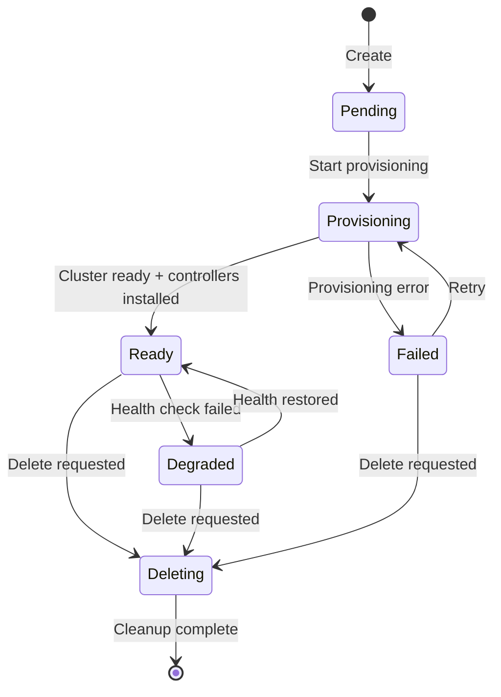
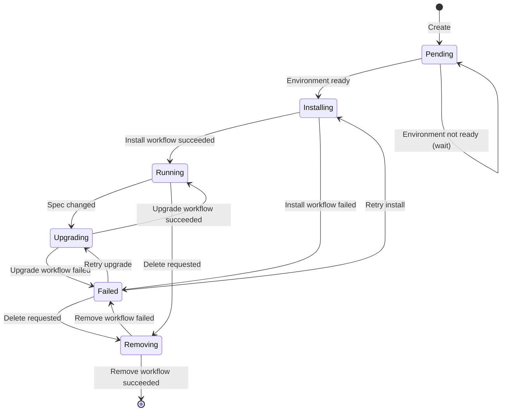
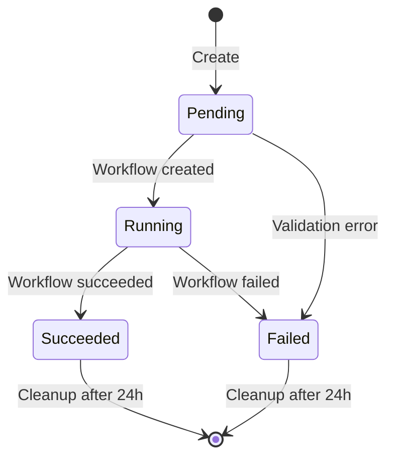
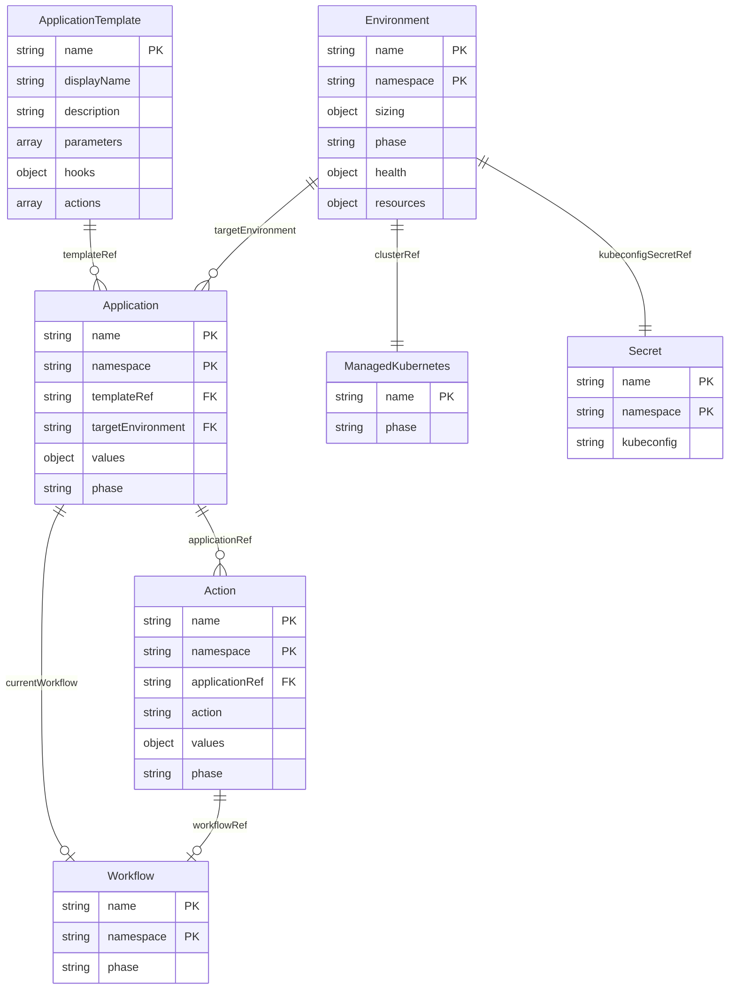
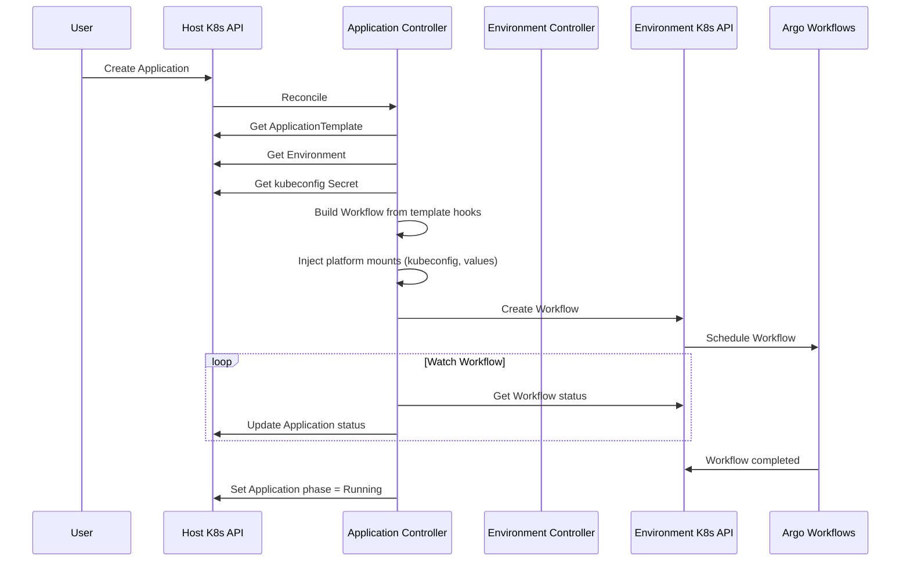

# ADR-0003: Controller Architecture

## Status

Proposed

## Context

The platform manages four CRDs: ApplicationTemplate, Application, Environment, and Action. Each requires reconciliation logic that:

- Watches resources in the host cluster
- Creates/manages resources in remote Environment clusters
- Tracks workflow execution status
- Handles lifecycle transitions

This ADR describes the controller architecture, state machines, and entity relationships.

## Decision

### Controller Overview

Single operator binary with multiple controllers:

```
┌─────────────────────────────────────────────────────────────┐
│                    cozy-apps-operator                       │
├─────────────────────────────────────────────────────────────┤
│  ┌─────────────────┐  ┌─────────────────┐                   │
│  │  Environment    │  │  Application    │                   │
│  │  Controller     │  │  Controller     │                   │
│  └─────────────────┘  └─────────────────┘                   │
│  ┌─────────────────┐  ┌─────────────────┐                   │
│  │  Action         │  │  Cleanup        │                   │
│  │  Controller     │  │  Controller     │                   │
│  └─────────────────┘  └─────────────────┘                   │
├─────────────────────────────────────────────────────────────┤
│                    Shared Components                        │
│  ┌─────────────────┐  ┌─────────────────┐                   │
│  │  Cluster        │  │  Workflow       │                   │
│  │  Client Cache   │  │  Builder        │                   │
│  └─────────────────┘  └─────────────────┘                   │
└─────────────────────────────────────────────────────────────┘
```

| Controller | Watches | Creates | Purpose |
|------------|---------|---------|---------|
| Environment | Environment | ManagedKubernetes, Secret | Provisions clusters, monitors health |
| Application | Application, Workflow | Workflow | Manages app lifecycle, triggers hooks |
| Action | Action, Workflow | Workflow | Executes user-triggered actions |
| Cleanup | Action | - | Deletes completed Actions after 24h |

### Environment Controller

#### State Machine



#### Reconciliation Logic

```
On Environment create/update:
  1. If phase == "" → set phase = Pending
  2. If phase == Pending:
     - Create ManagedKubernetes CR via Cozystack API
     - Set phase = Provisioning
  3. If phase == Provisioning:
     - Check ManagedKubernetes status
     - If ready:
       - Install Argo Workflows, Argo Events
       - Generate kubeconfig Secret
       - Set phase = Ready
     - If failed → set phase = Failed
  4. If phase == Ready:
     - Run health check (every 30s via requeue)
     - Update status.resources (nodes, cpu, memory)
     - If unhealthy → set phase = Degraded
  5. If phase == Degraded:
     - Continue health checks
     - If healthy → set phase = Ready

On Environment delete:
  1. Set phase = Deleting
  2. Delete all Applications in this Environment (block until done)
  3. Delete ManagedKubernetes CR
  4. Delete kubeconfig Secret
  5. Remove finalizer
```

### Application Controller

#### State Machine



#### Reconciliation Logic

```
On Application create/update:
  1. Validate:
     - templateRef exists (ApplicationTemplate)
     - targetEnvironment exists and is Ready
     - values match template parameter schema
  2. If validation fails → set condition ValidationFailed, return

  3. If phase == "" → set phase = Pending

  4. If phase == Pending:
     - Check Environment is Ready
     - If not ready → requeue
     - If ready → create install Workflow, set phase = Installing

  5. If phase == Installing:
     - Watch Workflow status
     - If succeeded → set phase = Running
     - If failed → set phase = Failed

  6. If phase == Running:
     - Check if spec changed (generation != observedGeneration)
     - If changed → create upgrade Workflow, set phase = Upgrading

  7. If phase == Upgrading:
     - Watch Workflow status
     - If succeeded → set phase = Running, update observedGeneration
     - If failed → set phase = Failed

  8. If phase == Failed:
     - Allow manual retry via annotation: apps.cozystack.io/retry=true

On Application delete:
  1. Set phase = Removing
  2. Create remove Workflow
  3. Wait for Workflow completion
  4. Remove finalizer
```

### Action Controller

#### State Machine



#### Reconciliation Logic

```
On Action create:
  1. Validate:
     - applicationRef exists and is Running
     - action exists in ApplicationTemplate.spec.actions
     - values match action parameter schema
  2. If validation fails → set phase = Failed, return

  3. Set phase = Pending
  4. Create Workflow from action steps
  5. Set phase = Running, record startedAt

  6. Watch Workflow status:
     - If succeeded → set phase = Succeeded, record completedAt
     - If failed → set phase = Failed, record completedAt

On Action update:
  - Actions are immutable after creation (except status)
```

### Cleanup Controller

Runs periodically (every 10 minutes):

```
For each Action where:
  - phase in [Succeeded, Failed]
  - completedAt + 24h < now
Do:
  - Delete Action CR
  - (Workflow is owned by Action, garbage collected automatically)
```

### Entity Relationship Diagram



### Workflow Creation Flow



### Multi-Cluster Client Management

Controller maintains a cache of clients for Environment clusters:

```go
type ClusterClientCache struct {
    clients map[string]*ClusterClient  // key: namespace/environment-name
    mu      sync.RWMutex
}

type ClusterClient struct {
    client     client.Client
    kubeconfig []byte
    expiresAt  time.Time  // Refresh kubeconfig periodically
}
```

- Clients are created lazily on first access
- Kubeconfig is refreshed every 5 minutes
- Stale clients (Environment deleted) are garbage collected

### Finalizers

| Resource | Finalizer | Purpose |
|----------|-----------|---------|
| Environment | `apps.cozystack.io/environment` | Cleanup ManagedKubernetes, Applications |
| Application | `apps.cozystack.io/application` | Run remove hook before deletion |
| Action | - | No finalizer needed (short-lived) |

### Leader Election

Single leader per controller to avoid conflicts:

```yaml
leaderElection:
  enabled: true
  resourceName: cozy-apps-operator
  resourceNamespace: cozy-system
```

## Consequences

### Positive

- Clear separation of concerns between controllers
- State machines make lifecycle explicit and debuggable
- Multi-cluster architecture keeps host cluster clean
- Finalizers ensure proper cleanup
- Shared client cache reduces connection overhead

### Negative

- Complexity of managing multiple cluster connections
- Workflow status polling adds latency (consider webhooks for future)
- Single operator binary — failure affects all controllers

### Risks

- Environment cluster unreachable — need timeout and retry logic
- Workflow stuck — need deadlines and cleanup
- Race conditions between Application and Action controllers
