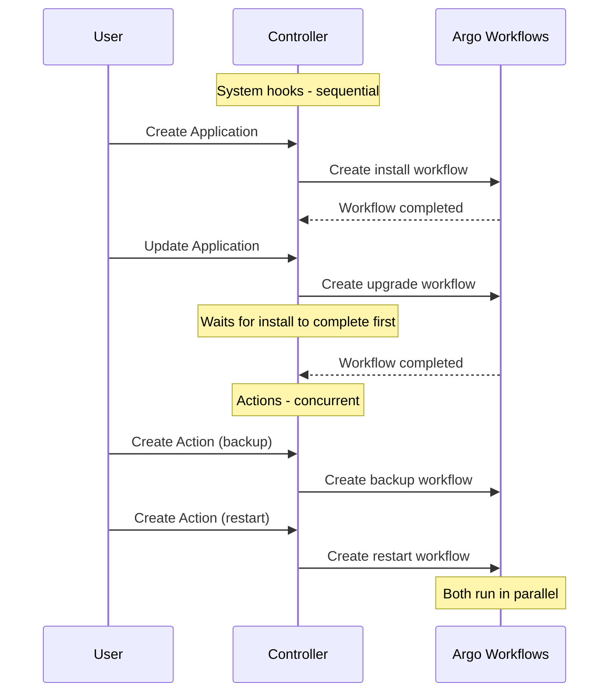
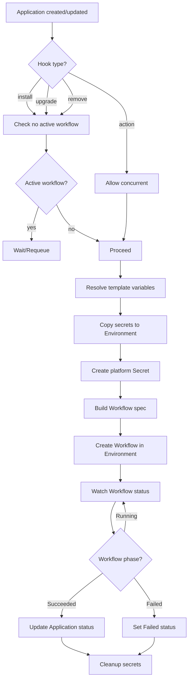

# ADR-0004: DAG Engine Integration

## Status

Proposed

## Context

Application lifecycle hooks and actions are executed as multi-step workflows. We use Argo Workflows as the DAG execution engine in Environment clusters. This ADR describes how ApplicationTemplate steps map to Argo Workflow resources.

## Decision

### Workflow Namespace

All workflows run in a single dedicated namespace in the Environment cluster:

```
argo-workflows
```

This simplifies RBAC, resource quotas, and monitoring.

### Workflow Naming

Format: `{app-name}-{hook/action}-{random-suffix}`

Examples:
- `my-minecraft-install-x7k9m`
- `my-minecraft-upgrade-p2n4q`
- `my-minecraft-backup-r8t2w`

### Execution Model

**System hooks** (`install`, `upgrade`, `remove`): Strictly sequential. Only one workflow per Application at a time. Controller waits for completion before starting next.

**Actions**: Concurrent execution allowed. Multiple actions can run simultaneously for the same Application. User responsibility to avoid conflicts.



### Step to Workflow Mapping

ApplicationTemplate step:

```yaml
steps:
  - name: deploy
    image: alpine/helm:3.14
    command: [helm]
    args:
      - install
      - "{{ .App.Name }}"
    env:
      - name: KUBECONFIG
        value: /platform/kubeconfig
    workingDir: /workspace
    dependsOn:
      - prepare
```

Maps to Argo Workflow DAG template:

```yaml
apiVersion: argoproj.io/v1alpha1
kind: Workflow
metadata:
  name: my-minecraft-install-x7k9m
  namespace: argo-workflows
spec:
  serviceAccountName: cozy-apps-workflow
  entrypoint: main

  # Workflow-level timeout (from hook config)
  activeDeadlineSeconds: 3600

  # Shared volume for inter-step data
  volumeClaimTemplates:
    - metadata:
        name: workspace
      spec:
        accessModes: ["ReadWriteOnce"]
        resources:
          requests:
            storage: 1Gi

  # Platform-injected volumes
  volumes:
    - name: platform
      projected:
        sources:
          - secret:
              name: my-minecraft-platform
              items:
                - key: kubeconfig
                  path: kubeconfig
                - key: values.yaml
                  path: values.yaml
                - key: app.yaml
                  path: app.yaml

  templates:
    - name: main
      dag:
        tasks:
          - name: deploy
            template: deploy
            dependencies:
              - prepare

    - name: deploy
      container:
        image: alpine/helm:3.14
        command: [helm]
        args:
          - install
          - my-minecraft
        env:
          - name: KUBECONFIG
            value: /platform/kubeconfig
        workingDir: /workspace
        volumeMounts:
          - name: workspace
            mountPath: /workspace
          - name: platform
            mountPath: /platform
            readOnly: true
        # Step-level timeout (if specified)
        activeDeadlineSeconds: 600
      # Retry policy (from template config)
      retryStrategy:
        limit: 3
        retryPolicy: OnFailure
```

### Template Variables

Variables available in step args/env:

| Variable | Description | Example |
|----------|-------------|---------|
| `{{ .App.Name }}` | Application name | `my-minecraft` |
| `{{ .App.Namespace }}` | Application namespace (in host) | `tenant-acme` |
| `{{ .Params.<name> }}` | Parameter value | `{{ .Params.serverName }}` |
| `{{ .Template.Name }}` | Template name | `minecraft` |
| `{{ .Action.Name }}` | Action name (for actions only) | `backup` |
| `{{ .Action.Params.<name> }}` | Action parameter value | `{{ .Action.Params.backupName }}` |

Variables are resolved by controller before creating Workflow.

### Platform Secret

Controller creates a Secret in Environment cluster with platform data:

```yaml
apiVersion: v1
kind: Secret
metadata:
  name: my-minecraft-platform
  namespace: argo-workflows
  ownerReferences:
    - apiVersion: argoproj.io/v1alpha1
      kind: Workflow
      name: my-minecraft-install-x7k9m
type: Opaque
stringData:
  kubeconfig: |
    apiVersion: v1
    kind: Config
    clusters:
      - name: host
        cluster:
          server: https://cozystack.example.com
          certificate-authority-data: ...
    ...

  values.yaml: |
    serverName: "ACME Gaming"
    maxPlayers: 50
    enableWhitelist: true
    ...

  app.yaml: |
    name: my-minecraft
    namespace: tenant-acme
    template: minecraft
    environment: production
```

Secret is owned by Workflow and garbage collected when Workflow is deleted.

### Additional Secret Mounts

Steps can reference additional secrets from the Application namespace:

```yaml
# In ApplicationTemplate
steps:
  - name: deploy
    image: alpine/helm:3.14
    args: [...]
    secretRefs:
      - name: custom-certs
        mountPath: /certs
      - name: registry-auth
        mountPath: /root/.docker
        items:
          - key: .dockerconfigjson
            path: config.json
```

Controller copies referenced secrets to Environment cluster before workflow execution.

Maps to:

```yaml
# In Workflow
volumes:
  - name: secret-custom-certs
    secret:
      secretName: my-minecraft-custom-certs
  - name: secret-registry-auth
    secret:
      secretName: my-minecraft-registry-auth
      items:
        - key: .dockerconfigjson
          path: config.json

# In container
volumeMounts:
  - name: secret-custom-certs
    mountPath: /certs
    readOnly: true
  - name: secret-registry-auth
    mountPath: /root/.docker
    readOnly: true
```

### Timeout Configuration

Timeouts are configured in ApplicationTemplate at hook/action level:

```yaml
hooks:
  install:
    timeout: 30m  # Workflow-level timeout
    steps:
      - name: deploy
        image: alpine/helm:3.14
        timeout: 10m  # Step-level timeout
        args: [...]
```

Defaults:
- Workflow timeout: 1 hour
- Step timeout: 30 minutes

### Retry Configuration

Retry policy configured per hook/action:

```yaml
hooks:
  install:
    retry:
      limit: 3
      policy: OnFailure  # OnFailure | OnError | Always
      backoff:
        duration: 10s
        factor: 2
        maxDuration: 5m
    steps:
      - name: deploy
        # Inherits hook-level retry
```

Or per step:

```yaml
steps:
  - name: deploy
    image: alpine/helm:3.14
    retry:
      limit: 5
      policy: OnFailure
```

Step-level retry overrides hook-level.

### Shared Workspace

All steps share a workspace volume for inter-step data passing:

```
/workspace
├── artifacts/      # Step outputs
├── tmp/            # Temporary files
└── ...             # Any files created by steps
```

Volume is ephemeral (PVC) and deleted with Workflow.

### Workflow Status Mapping

| Argo Workflow Phase | Application/Action Phase |
|---------------------|--------------------------|
| Pending | Installing/Upgrading/Removing/Running |
| Running | Installing/Upgrading/Removing/Running |
| Succeeded | Running (for app) / Succeeded (for action) |
| Failed | Failed |
| Error | Failed |

### Workflow Cleanup

Workflows are retained for debugging:

| Scenario | Retention |
|----------|-----------|
| Succeeded | 1 hour |
| Failed | 24 hours |

Argo Workflows garbage collector handles cleanup via `ttlStrategy`:

```yaml
spec:
  ttlStrategy:
    secondsAfterCompletion: 3600   # 1 hour for success
    secondsAfterFailure: 86400    # 24 hours for failure
```

### ServiceAccount

Workflows run with a dedicated ServiceAccount with cluster-admin:

```yaml
apiVersion: v1
kind: ServiceAccount
metadata:
  name: cozy-apps-workflow
  namespace: argo-workflows

---
apiVersion: rbac.authorization.k8s.io/v1
kind: ClusterRoleBinding
metadata:
  name: cozy-apps-workflow-admin
subjects:
  - kind: ServiceAccount
    name: cozy-apps-workflow
    namespace: argo-workflows
roleRef:
  kind: ClusterRole
  name: cluster-admin
  apiGroup: rbac.authorization.k8s.io
```

### Workflow Creation Flow



## Consequences

### Positive

- Leverages battle-tested Argo Workflows for execution
- DAG support via `dependsOn` for complex workflows
- Built-in retry and timeout handling
- Shared workspace simplifies inter-step communication
- Workflow logs available via Argo UI

### Negative

- Argo Workflows is a heavy dependency
- Secret copying between clusters adds latency
- Workflow status polling (no webhooks yet)

### Risks

- Argo Workflows version compatibility
- PVC provisioning may fail in some environments
- Cluster-admin ServiceAccount is powerful — needs audit logging
