# ADR-0005: User Flows

## Status

Proposed

## Context

The platform serves multiple user personas with different goals and technical expertise. This ADR documents the key user flows for each persona.

## User Personas

| Persona | Description | Technical Level |
|---------|-------------|-----------------|
| **End User** | ISP customer, wants to run apps | Low (no K8s knowledge) |
| **Template Author** | Community contributor, creates templates | High (K8s, Helm, scripting) |
| **ISP Operator** | Manages Cozystack platform | High (K8s admin) |
| **Developer** | Uses platform as dev environment | Medium (understands git, CI/CD) |

## End User Flows

### Flow 1: Deploy Application from Catalog

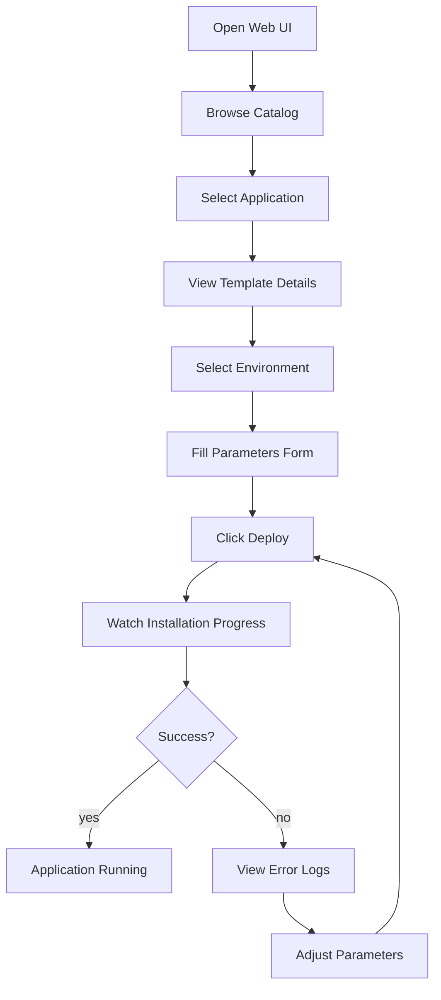

**Step by step:**

1. **Open Web UI** — User logs into tenant dashboard
2. **Browse Catalog** — Views available ApplicationTemplates
   - Categories: Games, Databases, Web Apps, etc.
   - Search by name
   - Filter by tags
3. **Select Application** — e.g., "Minecraft Server"
4. **View Template Details** — Description, parameters, requirements
5. **Select Environment** — Choose from available Environments (production, staging)
6. **Fill Parameters Form** — UI renders form based on template parameters
   - Labels, descriptions, placeholders from `ui` hints
   - Validation in real-time
   - Defaults pre-filled
7. **Click Deploy** — Creates Application CR
8. **Watch Installation Progress** — Real-time workflow status
9. **Application Running** — Access endpoints, view status

### Flow 2: Manage Running Application

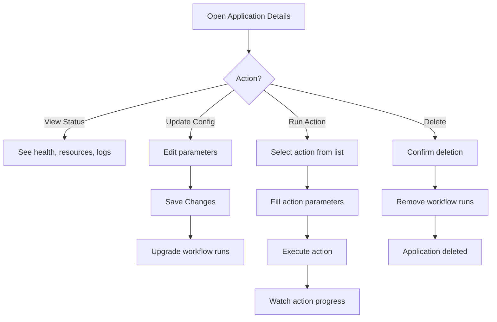

**Actions available:**
- View status, health, resource usage
- View application logs (from Argo)
- Update configuration (triggers upgrade hook)
- Run custom actions (backup, restart, etc.)
- Delete application (triggers remove hook)

### Flow 2.1: Debug Application

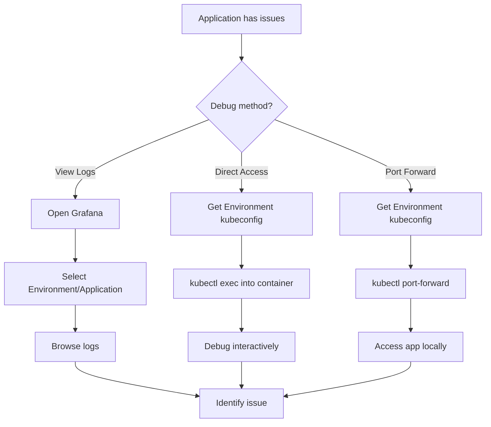

**Debugging options:**

1. **Centralized Logs (Grafana)**
   - Access via Cozystack Grafana dashboard
   - Filter by Environment and Application
   - Search across all containers

2. **Direct Cluster Access**
   - Download kubeconfig from Environment details
   - Use standard kubectl commands:
     ```bash
     # Get kubeconfig
     kubectl get secret production-kubeconfig -o jsonpath='{.data.kubeconfig}' | base64 -d > kubeconfig

     # Exec into container
     kubectl --kubeconfig=kubeconfig exec -it deployment/my-app -- /bin/sh

     # Port forward
     kubectl --kubeconfig=kubeconfig port-forward svc/my-app 8080:80

     # Stream logs
     kubectl --kubeconfig=kubeconfig logs -f deployment/my-app
     ```

3. **Workflow Logs**
   - For install/upgrade failures: view Argo Workflow logs
   - Available in Application details UI

### Flow 3: Create Environment

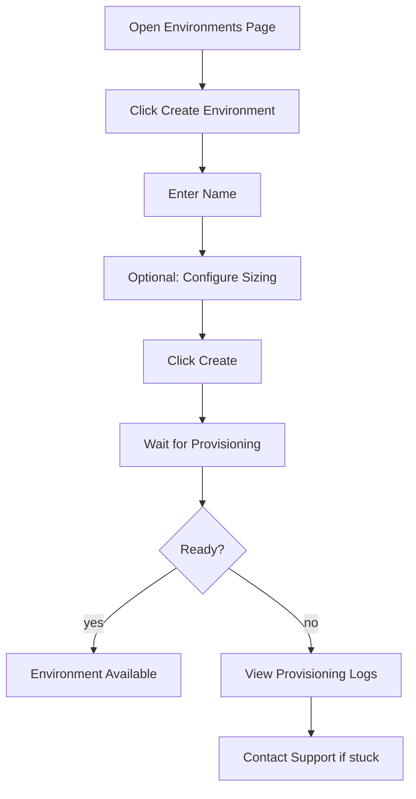

**Notes:**
- Environment provisioning takes several minutes
- User sees progress: Pending → Provisioning → Ready
- Once Ready, can deploy Applications

---

## Template Author Flows

### Flow 4: Create New Template

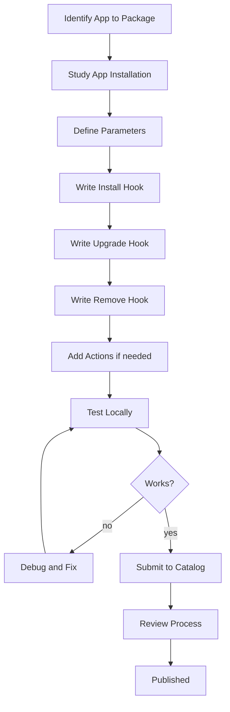

**Step by step:**

1. **Identify App** — Choose application to package (e.g., Valheim server)

2. **Study Installation** — Understand how app is normally deployed
   - Helm chart? Raw manifests? Docker compose?
   - What config options exist?
   - What secrets needed?

3. **Define Parameters** — Extract user-configurable values
   ```yaml
   parameters:
     - name: serverName
       type: string
       required: true
       ui:
         label: "Server Name"
     - name: worldSeed
       type: string
       required: false
       ui:
         label: "World Seed"
         description: "Leave empty for random"
   ```

4. **Write Install Hook** — Steps to deploy app
   ```yaml
   hooks:
     install:
       timeout: 15m
       steps:
         - name: add-repo
           image: alpine/helm:3.14
           args: [helm, repo, add, valheim, "https://..."]
         - name: deploy
           image: alpine/helm:3.14
           args:
             - helm
             - install
             - "{{ .App.Name }}"
             - valheim/valheim
             - --set
             - "server.name={{ .Params.serverName }}"
           dependsOn: [add-repo]
   ```

5. **Write Upgrade Hook** — Steps to update existing deployment

6. **Write Remove Hook** — Steps to clean up

7. **Add Actions** — Optional custom operations
   ```yaml
   actions:
     - name: backup-world
       displayName: "Backup World"
       steps:
         - name: backup
           image: restic/restic
           args: [...]
   ```

8. **Test Locally** — Deploy in test environment, verify all hooks

9. **Submit to Catalog** — PR to community repository

10. **Review Process** — Maintainers review for security, quality

### Template Development Best Practices

```
DO:
✓ Use well-known base images (alpine/helm, bitnami/kubectl)
✓ Handle idempotency (install should work if partially applied)
✓ Clean up all resources in remove hook
✓ Provide sensible defaults
✓ Write clear parameter descriptions

DON'T:
✗ Hardcode values that should be parameters
✗ Assume specific cluster configuration
✗ Leave orphaned resources on failure
✗ Use latest tags (pin versions)
✗ Store secrets in plain text
```

---

## ISP Operator Flows

### Flow 5: Initial Platform Setup

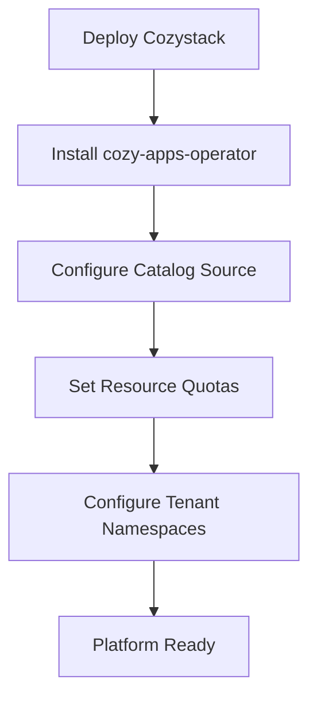

**Components to deploy:**
1. **Cozystack** — Base platform with managed Kubernetes capability
2. **cozy-apps-operator** — Controller for Application/Environment/Action CRDs
3. **Catalog sync** — Populate ApplicationTemplates from community catalog

### Flow 6: Tenant Onboarding

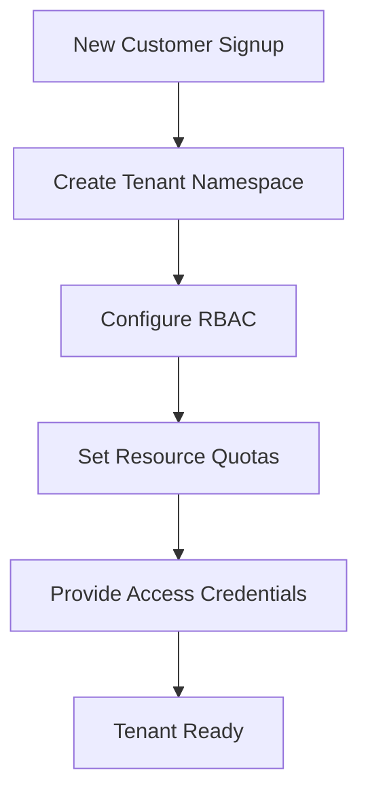

**Per-tenant setup:**
```yaml
# Namespace for tenant resources
apiVersion: v1
kind: Namespace
metadata:
  name: tenant-acme
  labels:
    cozy.io/tenant: "true"

---
# Resource quotas
apiVersion: v1
kind: ResourceQuota
metadata:
  name: tenant-quota
  namespace: tenant-acme
spec:
  hard:
    environments: "3"        # Max 3 environments
    applications: "20"       # Max 20 applications
    actions: "100"           # Max 100 concurrent actions
```

### Flow 7: Custom Template for Customer

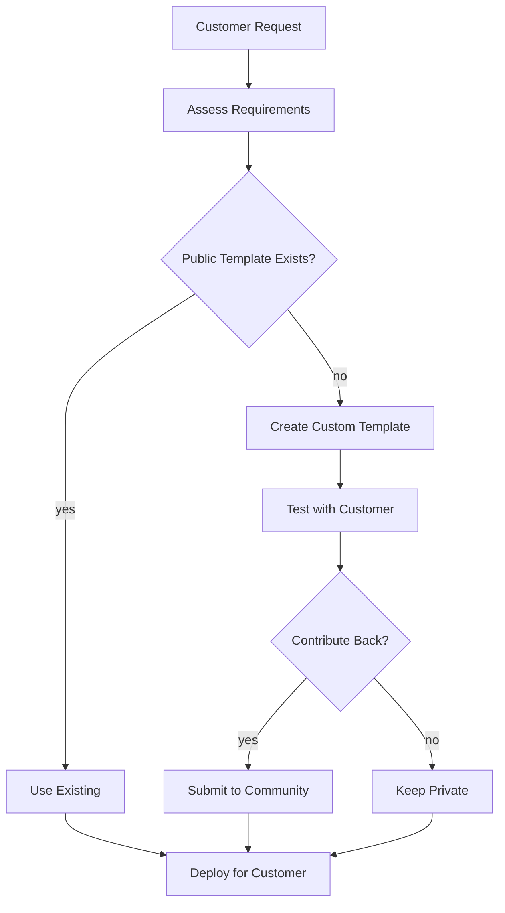

### Flow 8: Monitoring and Troubleshooting

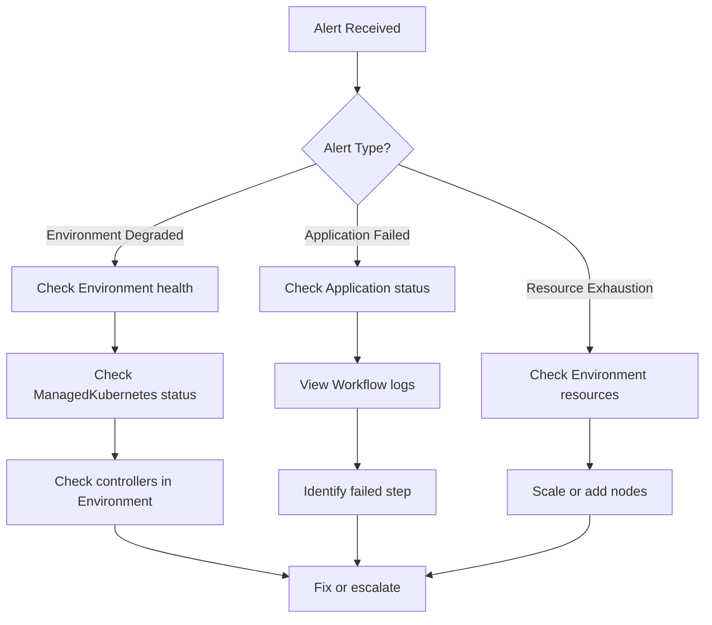

---

## Developer Platform Flows

### Flow 9: Deploy Application from Git

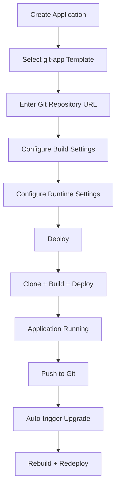

**Git-based Application Template:**
```yaml
apiVersion: apps.cozystack.io/v1alpha1
kind: ApplicationTemplate
metadata:
  name: git-nodejs-app
spec:
  displayName: "Node.js Application (Git)"
  description: "Deploy Node.js app from Git repository"

  parameters:
    - name: gitUrl
      type: string
      required: true
      ui:
        label: "Git Repository URL"
        placeholder: "https://github.com/user/repo.git"

    - name: branch
      type: string
      required: false
      default: "main"
      ui:
        label: "Branch"

    - name: buildCommand
      type: string
      required: false
      default: "npm run build"
      ui:
        label: "Build Command"

    - name: port
      type: int
      required: false
      default: 3000
      ui:
        label: "Application Port"

  hooks:
    install:
      timeout: 30m
      steps:
        - name: clone
          image: alpine/git
          args:
            - git
            - clone
            - --branch
            - "{{ .Params.branch }}"
            - "{{ .Params.gitUrl }}"
            - /workspace/app

        - name: build
          image: gcr.io/kaniko-project/executor:latest
          args:
            - --dockerfile=/workspace/app/Dockerfile
            - --context=/workspace/app
            - --destination=registry.local/{{ .App.Name }}:latest
          dependsOn: [clone]

        - name: deploy
          image: bitnami/kubectl
          args:
            - kubectl
            - apply
            - --filename
            - /workspace/manifests/
          dependsOn: [build]

    upgrade:
      timeout: 30m
      steps:
        # Same as install - pull latest, rebuild, redeploy
        - name: clone
          image: alpine/git
          args: [git, clone, --branch, "{{ .Params.branch }}", "{{ .Params.gitUrl }}", /workspace/app]

        - name: build
          image: gcr.io/kaniko-project/executor:latest
          args: [--dockerfile=/workspace/app/Dockerfile, --context=/workspace/app, --destination=registry.local/{{ .App.Name }}:latest]
          dependsOn: [clone]

        - name: deploy
          image: bitnami/kubectl
          args: [kubectl, apply, --filename, /workspace/manifests/]
          dependsOn: [build]

  actions:
    - name: rebuild
      displayName: "Rebuild & Deploy"
      description: "Force rebuild from latest git commit"
      steps:
        - name: clone
          image: alpine/git
          args: [git, clone, --branch, "{{ .Params.branch }}", "{{ .Params.gitUrl }}", /workspace/app]
        - name: build
          image: gcr.io/kaniko-project/executor:latest
          args: [--dockerfile=/workspace/app/Dockerfile, --context=/workspace/app, --destination=registry.local/{{ .App.Name }}:latest, --no-cache]
          dependsOn: [clone]
        - name: deploy
          image: bitnami/kubectl
          args: [kubectl, rollout, restart, deployment/{{ .App.Name }}]
          dependsOn: [build]
```

### Flow 10: Preview Environments

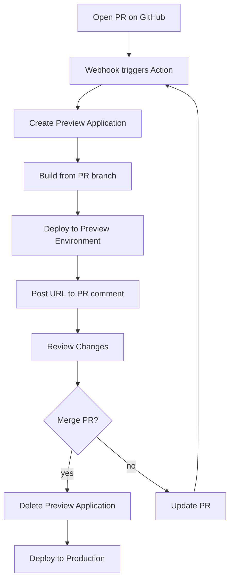

**Notes:**
- Requires Argo Events for webhook integration
- Preview Environment can be shared or per-PR
- Automatic cleanup on PR close/merge

### Flow 11: Database Provisioning

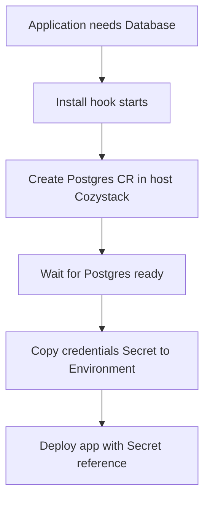

**Database-aware template example:**
```yaml
hooks:
  install:
    steps:
      # Create Postgres in host Cozystack cluster (via platform kubeconfig)
      - name: create-database
        image: bitnami/kubectl
        env:
          - name: KUBECONFIG
            value: /platform/kubeconfig
        args:
          - kubectl
          - apply
          - --filename
          - -
        stdin: |
          apiVersion: cozystack.io/v1alpha1
          kind: Postgres
          metadata:
            name: {{ .App.Name }}-db
            namespace: {{ .App.Namespace }}
          spec:
            version: "15"
            storage: 10Gi

      # Wait for Postgres ready in host cluster
      - name: wait-database
        image: bitnami/kubectl
        env:
          - name: KUBECONFIG
            value: /platform/kubeconfig
        args:
          - kubectl
          - wait
          - --for=condition=Ready
          - postgres/{{ .App.Name }}-db
          - --namespace={{ .App.Namespace }}
          - --timeout=10m
        dependsOn: [create-database]

      # Copy credentials from host cluster to Environment cluster
      - name: copy-credentials
        image: bitnami/kubectl
        script: |
          # Get secret from host Cozystack
          kubectl --kubeconfig=/platform/kubeconfig \
            get secret {{ .App.Name }}-db-credentials \
            --namespace={{ .App.Namespace }} \
            --output=yaml > /workspace/db-secret.yaml

          # Remove metadata that prevents creation
          sed -i '/resourceVersion/d; /uid/d; /creationTimestamp/d' /workspace/db-secret.yaml

          # Apply to Environment cluster (default kubeconfig)
          kubectl apply --filename /workspace/db-secret.yaml
        dependsOn: [wait-database]

      # Deploy application with database credentials
      - name: deploy-app
        image: alpine/helm:3.14
        args:
          - helm
          - install
          - "{{ .App.Name }}"
          - myapp/myapp
          - --set
          - "database.secretName={{ .App.Name }}-db-credentials"
        dependsOn: [copy-credentials]
```

---

## Summary

| Persona | Primary Actions | Technical Barrier |
|---------|-----------------|-------------------|
| End User | Deploy apps, manage instances, run actions | None (UI-driven) |
| Template Author | Write YAML, test hooks, submit PRs | High (K8s expertise) |
| ISP Operator | Platform setup, tenant management, monitoring | High (K8s admin) |
| Developer | Git-based deploys, preview envs, databases | Medium (CI/CD concepts) |

## Consequences

### Positive

- Clear separation of concerns between personas
- End users don't need Kubernetes knowledge
- Template authors have full flexibility
- ISP operators maintain control
- Developer platform emerges naturally from same abstractions

### Negative

- Multiple personas means multiple UIs/interfaces to maintain
- Template quality depends on community contribution
- Developer flows require additional components (Argo Events, registry)

### Risks

- Template author barrier may limit catalog growth
- Preview environments can consume significant resources
- Git webhook integration adds security considerations
